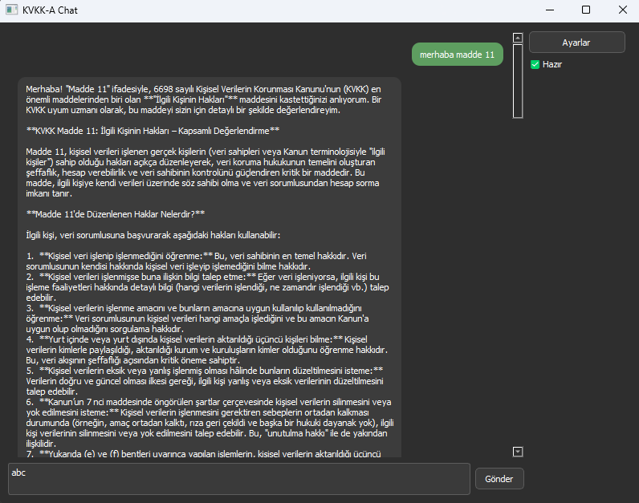
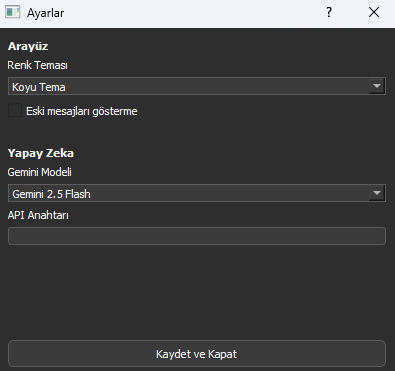

# KVKK-A (Kişisel Verilerin Korunması Kanunu Asistanı)

KVKK Asistanı, Türk Kişisel Verilerin Korunması Kanunu (KVKK) uyum süreçlerinde uzmanları desteklemek amacıyla geliştirilmiş, Google Gemini AI destekli masaüstü chat uygulamasıdır. Kullanıcıların KVKK ile ilgili sorularını yanıtlar ve metinleri kanun maddeleri çerçevesinde analiz eder.

### Ana Sohbet Ekranı


### Ayarlar Sekmesi


## 🚀 Özellikler

- **KVKK Uzmanı AI Asistanı**: Google Gemini modelleri ile güçlendirilmiş KVKK uyum uzmanı
- **Çoklu Gemini Model Desteği**: Gemini 2.5 Pro, Flash, Flash-Lite ve diğer modeller arasında seçim
- **Modern Arayüz**: PyQt5 ile geliştirilmiş, koyu/açık tema desteği olan kullanıcı dostu arayüz
- **Sohbet Geçmişi**: Mesaj geçmişi otomatik kaydı ve gizleme seçeneği
- **Gerçek Zamanlı Durum Göstergesi**: AI durumu (düşünüyor, bağlanıyor, hazır, hata) göstergesi
- **Çoklu Threading**: UI donmaması için arka planda AI işleme
- **Güvenli API Yönetimi**: API anahtarları şifreli depolama
- **Otomatik Boyutlandırma**: Mesaj baloncukları ekran boyutuna göre otomatik uyum

## 🏗️ Proje Yapısı

```
KVKK-A/
├── main.py                  # Ana uygulama giriş noktası
├── chat_initializer.py      # AI chat işlemlerini yöneten modül
├── ui_initializer.py        # PyQt5 arayüz bileşenleri
├── config.py               # Uygulama konfigürasyonu ve sabitler
├── history_manager.py      # Sohbet geçmişi yönetimi
├── settings.py             # Kullanıcı ayarları yönetimi
├── data/                   # Veri dosyaları
│   ├── chat_history.json   # Sohbet geçmişi (JSON formatında)
│   └── settings.json       # Kullanıcı ayarları
├── screenshots/            # Uygulama ekran görüntüleri
├── __pycache__/           # Python önbellek dosyaları
├── LICENSE                # MIT lisans dosyası
└── README.md              # Bu dosya
```

## 🛠️ Kurulum

### Gereksinimler
- Python 3.8 veya üzeri
- PyQt5 5.15+
- Google GenerativeAI library
- Google Cloud API anahtarı (Gemini erişimi için)

### Adım Adım Kurulum

1. **Projeyi klonlayın:**
```bash
git clone https://github.com/batuhan-arda/KVKK-A.git
cd KVKK-A
```

2. **Gerekli kütüphaneleri yükleyin:**
```bash
pip install PyQt5 google-generativeai
```

3. **Google Cloud API anahtarı alın:**
   - [Google AI Studio](https://makersuite.google.com/app/apikey) üzerinden API anahtarı oluşturun
   - Gemini API erişimi için gerekli izinleri ayarlayın

4. **Uygulamayı başlatın:**
```bash
python main.py
```

5. **İlk kurulum:**
   - Uygulama açıldığında "Ayarlar" butonuna tıklayın
   - API anahtarınızı girin
   - İstediğiniz Gemini modelini seçin
   - Tema tercihinizi belirleyin
   - "Kaydet ve Kapat" butonuna tıklayın

## 🎯 Kullanım

### Temel Kullanım
1. Uygulama açıldığında chat arayüzü görünür
2. Alt kısımdaki metin kutusuna KVKK ile ilgili sorunuzu yazın
3. "Gönder" butonuna tıklayın veya Enter tuşuna basın
4. AI asistan, KVKK uzmanı perspektifinden yanıt verir
5. Sağ üst köşedeki durum göstergesi AI'ın durumunu gösterir

### Ayarlar
- **Tema**: Açık/Koyu tema seçimi
- **Gemini Modeli**: Farklı AI modelleri arasında seçim
- **API Anahtarı**: Google Cloud API anahtarınız
- **Eski Mesajları Gösterme**: Geçmiş mesajları gizleme/gösterme

### Durum Göstergeleri
- ✅ **Hazır**: AI yanıt vermeye hazır
- 🤔 **Yapay zeka düşünüyor**: AI yanıt hazırlıyor
- 🔄 **Gemini'ye bağlanıyor**: API bağlantısı kuruluyor
- 🔑 **API anahtarı hatası**: Geçersiz veya eksik API anahtarı
- ⚠️ **API kotası doldu**: Günlük limit aşıldı
- 🌐 **Bağlantı hatası**: İnternet bağlantı sorunu

## 🔧 Teknik Detaylar

### Mimari
- **Multi-threading**: UI thread ve AI processing thread ayrımı
- **Queue-based Communication**: Thread'ler arası güvenli iletişim
- **State Management**: Merkezi ayar ve geçmiş yönetimi
- **Error Handling**: Kapsamlı hata yakalama ve kullanıcı bildirimi

### Veri Depolama
- **chat_history.json**: Tüm sohbet geçmişi (max 100 mesaj)
- **settings.json**: Kullanıcı tercihleri ve API anahtarı
- **JSON Format**: İnsan okunabilir ve taşınabilir format

### Güvenlik
- API anahtarları şifreli input alanında gösterilir
- Yerel veri depolama (cloud'a gönderilmez)
- Hata mesajlarında hassas bilgi ifşası önlenir

## 📝 Lisans

Bu proje MIT lisansı altında lisanslanmıştır. Detaylar için [LICENSE](LICENSE) dosyasına bakın.

---

**Not**: Bu uygulama KVKK uyum süreçlerinde yardımcı bir araç olarak tasarlanmıştır. Hukuki danışmanlık yerine geçmez, kesin hukuki kararlar için uzman avukatlardan destek alınması önerilir.
